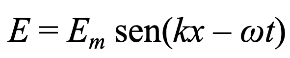
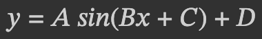
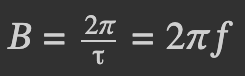
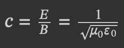
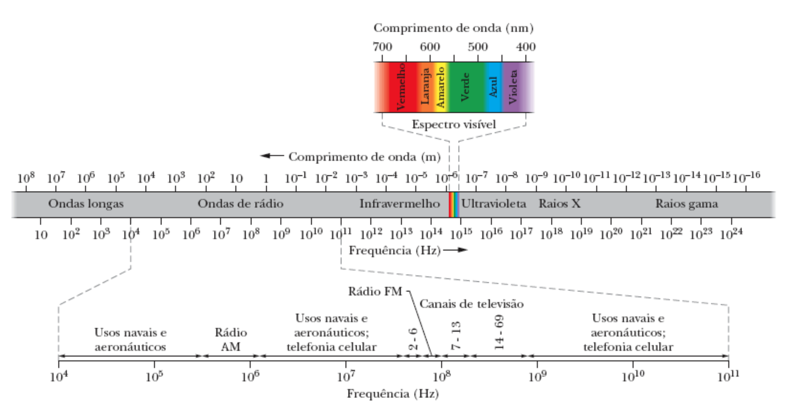
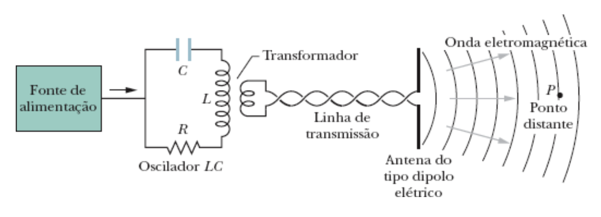

# Radiação Eletromagnética

## Dualidade onda-partícula da luz
- Luz é radiação ou onda eletromagnética capaz de produzir sensação visual.
- A luz se locomove transportando energia, em algumas situações conforme modelo de onda, e em outras situações conforme modelo de partícula. Este padrão é da dualidade onda-partícula.
- A locomoção da luz, conforme modelo de onda, apresenta as seguintes características:
    - 2 ondas cujos planos são perpendiculares
        - 1 onda elétrica E
        - 1 onda magnética B
    - O movimento das duas ondas ocorre:
        - com propagação horizontal no eixo X (similar) dos dois planos e 
        - com oscilação vertical no eixo Y (diferentes) de cada plano. 
    - Cada uma das duas ondas possui movimento do tipo transversal.
- Comprimento de onda visível entre 380 nm a 780 nm.
- Frequência de onda entre XXX e XXX.

## Experimento de Young
- Pergunta: A luz é uma onda ou uma partícula?
- Experimento mostra que Luz se comporta como uma onda, no experimento da dupla fenda.
- Ao inves de ver apenas 2 fendas, se vê padrões escuros e claros. Franjas claras e franjas escuras.
- O resultado do experimento é explicada pela interferência de ondas.
- Luz passa por uma única fenda e passa ter padrão de única fase, onda coerente.
- Depois a luz de única fase passa por obstáculos de 2 fendas.
- PICO com PICO ou VALE com VALE sofrem interferência construtiva que gera a franja clara.
- PICO com VALE sofrem interferência destrutiva que gera franja escura.
- YOUNG calculou o comprimento das ondas e das franjas, em seu experimento:
    - Franja clara: n=0
    - Franjas claras: n=1 e n=1
    - Franjas claras: n=2 e n=2
    - distância entre n=0 e n=1 igual a x
    - distância entre fendas do segundo obstáculo: d
    - Distância L entre segundo obstáculo e local de franjas.

## Caracterítica da Luz
- A luz branca do sol possui todas as cores visíveis.
- A refração da LUZ branca produz separação de todas as suas cores.
- No vácuo, todas as frequências das radiações possuem a mesma velocidade.
- No meio material, as radiações de diferentes frequências possuem diferentes velocidades.
    - Maior frequência passa a ter menor velocidade. Devido maior desvio.
    - Menor frequência passa a ter maior velocidade. Devido menor desvio.

        

## Reflexão Total
- Indice de refração dos meios de propagação

Lei de Snel
- n1.senO1 = n2.senO2

- a LUZ passa do meio mais lento para o meio mais rápido

## Radiação de Rádio AM
- Comprimento de Onda
- Amplitude de Onda
- Frequência de Onda
- Equação de Movimento das Ondas de Rádio
- Oscilação do Phóton
- Constante de Planck
- Energia do Phóton

## Radiação de Rádio FM
- Comprimento de Onda
- Amplitude de Onda
- Frequência de Onda
- Equação de Movimento das Ondas de Rádio
- Oscilação do Phóton
- Constante de Planck
- Energia do Phóton

## Radiação de Televisão
- Comprimento de Onda
- Amplitude de Onda
- Frequência de Onda
- Equação de Movimento das Ondas de Rádio
- Oscilação do Phóton
- Constante de Planck
- Energia do Phóton

## Radiação de Luz Infravermelha
- Comprimento de Onda
- Amplitude de Onda
- Frequência de Onda
- Equação de Movimento das Ondas de Rádio
- Oscilação do Phóton
- Constante de Planck
- Energia do Phóton

## Radiação de Luz Visível
- Comprimento de Onda
- Amplitude de Onda
- Frequência de Onda
- Equação de Movimento das Ondas de Rádio
- Oscilação do Phóton
- Constante de Planck
- Energia do Phóton

## Radiação de Luz Ultravioleta
- Comprimento de Onda
- Amplitude de Onda
- Frequência de Onda
- Equação de Movimento das Ondas de Rádio
- Oscilação do Phóton
- Constante de Planck
- Energia do Phóton

## Radiação de Raios X
- Comprimento de Onda
- Amplitude de Onda
- Frequência de Onda
- Equação de Movimento das Ondas de Rádio
- Oscilação do Phóton
- Constante de Planck
- Energia do Phóton

## Radiação de Raios Gama
- Comprimento de Onda
- Amplitude de Onda
- Frequência de Onda
- Equação de Movimento das Ondas de Rádio
- Oscilação do Phóton
- Constante de Planck
- Energia do Phóton

## Propriedades da onda
### Indutância (L)
### Capacitância (C)
### Comprimento de onda (lambda)
### Período de uma onda (T)
### Frequência do movimento ondulatório (f)
### Frequência Angular (w) do circuito
### Velocidade da Luz no vácuo
### Velocidade da Luz no ar
- A velocidade de qualquer onda eletromagnéticda no vácuo é igual a:

### Componente de vetor elétrico de uma onda eletromagnética
    - Uma onda eletromagnética é formada por campos elétricos e magnéticos que variam com o tempo.
    - As várias frequências possíveis das ondas eletromagnéticas formam um espectro, uma parte deste espectro representa a luz visível. 
    - Vetor elétrico perpendicular à direção do movimento
    - Vetor elétrico perpendicular ao componente magnético
### Componente de vetor magnético de uma onda eletromagnética
    - Vetor magnético perpendicular à direção do movimento
    - Vetor magnético perpendicular ao componente elétrico
### Ondas eletromagnéticas senoidais com a mesma frequência e a mesma fase.
### Constante Elétrica E0
### Constante Magnética M0
### Módulo campo elétrico
### Módulo campo magnético
### Velocidade da Luz c de uma onda eletromagnética em um dado instante e em uma dada posição.
### Relação entre velocidade da luz c e a razão entre amplitude E do campo elétrocp e a amplitude B do campo magnético.
### Módulo do Campo Elétrico

- Sendo:
    - 
    - parâmetro y nomeado como "E" é o módulo do campo elétrico
    - parâmetro A da amplitude nomeada como "Em" é a amplitude da onda senoidal
    - parâmetro B está presente dentro de (kx-wt):
    - 
    - parâmetro d da fase está presente dentro de (kx-wt)
    - Como se tem dois dados de entrada: "x" e "t", deve-se desconsiderar os parâmetros "c" e "d" tratados como isolados e buscar identificar a soma kx-wt.
    - parâmetro D do deslocamento vertical é igual a zero
    - O campo elétrico induz o campo magnético e é induzido por este mesmo campo.

### Módulo do Campo Magnético

- Sendo:
    - 
    - parâmetro y nomeado como "E" é o módulo do campo magnético
    - parâmetro A da amplitude nomeada como "Em" é a amplitude da onda senoidal
    - parâmetro B está presente dentro de (kx-wt):
    -  
    - parâmetro d da fase está presente dentro de (kx-wt)
    - Como se tem dois dados de entrada: "x" e "t", deve-se desconsiderar os parâmetros "c" e "d" tratados como isolados e buscar identificar a soma kx-wt.
    - parâmetro D do deslocamento vertical é igual a zero
    - O campo magnético induz o campo elétrico e é induzido por este mesmo campo.

### Velocidade da Luz no Vácuo
- Todas as ondas eletromagnéticas se propagam no vácuo com a mesma velocidade "c".
- 
- Sendo:
    - c a velocidade da luz em metros por segundo
    - E o módulo do campo elétrico no momento do cálculo
    - B o módulo do campo magnético no momento do cálculo
    - "Mu 0" o 
    - "Epsilon 0" o

## Espectro de ondas eletromagnéticas
- 
- As bandas de ondas de TV e de rádio AM são usadas para fins comerciais e são definidas legalmente.
- Dos maiores para os menores comprimentos de onda:
    - Ondas longas (uso naval e aeronáutico)
    - Rádio AM
    - Rádio FM
    - Ondas de Televisão
    - Ondas de Telefonia Celular
    - Infravermelho
    - Vermelho
    - Laranja
    - Amarelo
    - Verde
    - Azul
    - Violeta
    - Ultravioleta
    - Raios X
    - Raios gama
- Das maiores para as menores frequências de onda:
    - Raios gama
    - Raios X
    - Ultravioleta
    - Violeta
    - Azul
    - Verde
    - Amarelo
    - Laranja
    - Vermelho
    - Infravermelho
    - Ondas de Telefonia Celular
    - Ondas de Televisão
    - Rádio FM
    - Rádio AM
    - Ondas Longas

# Produção de Ondas Eletromagnéticas    
- Raios Gama, Raios X e Ondas do Espectro Visível são produzidos por fontes de dimensões atômicas ou mesmo nucleares, cujas interações seguem princípios da física quântica.
- Pensemos na produção de uma onda cujo "comprimento de onda" é igual a 1 metro. E cuja fonte de emissão é macroscópica.
    -  
    - Oscilador LC
    - Produz onda com frequência angular w = 1/sqrt(LC)
    - As cargas e correntes do circuito variam conforme uma função senoidal.
    - Um gerador CA fornece a energia cuja parte que não é convertida em calor é transportada pela onda eletromagnética.
    - O Oscilador LC está acoplado, por meio de um transformador e de uma linha de transmissão, a uma antena.
    - A Antena consiste essencialmente em dois condutores retilíneos.
    - Por meio do acoplamento, a corrente senoidal do oscilador produz correntes senoidais nos elementos da antena, com uma frequência angular em específico.
    - Como essas correntes fazem com que as cargas nos elementos da antena se aproximem e se afastem periodicamente, a antena pode ser vista como um dipolo elétrico, cujo momento dipolar elétrico varia senoidalmente em módulo e sentido ao longo do eixo da antena.
    
    
    
    
    
    