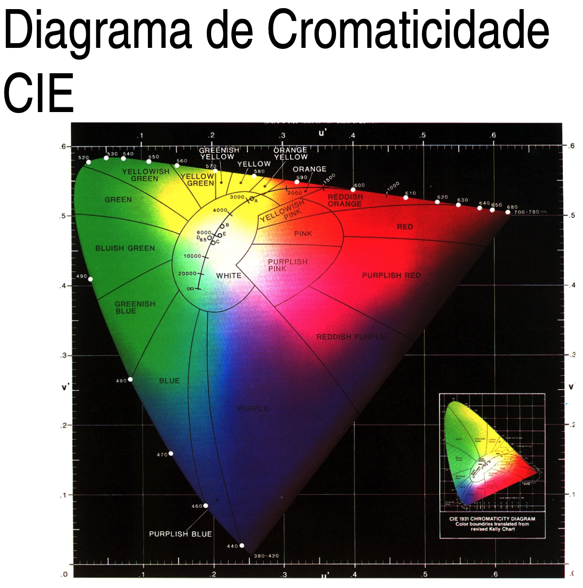
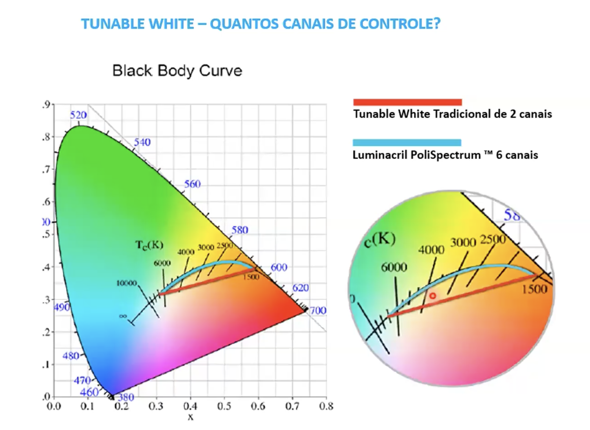
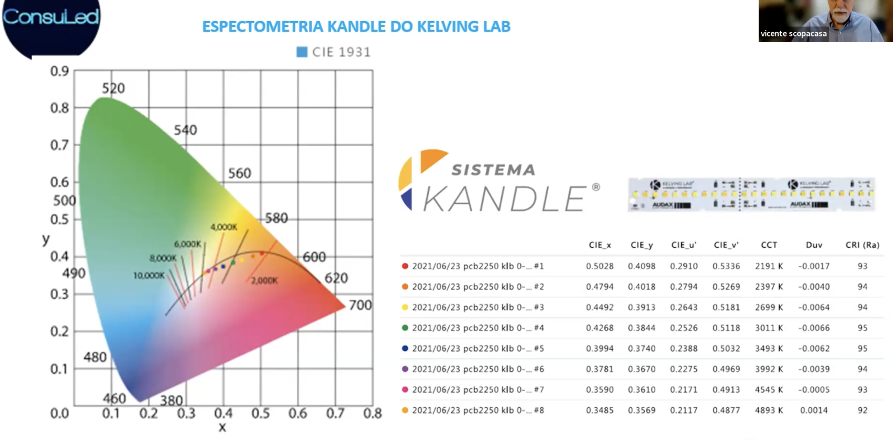

# Gráfico Colorimétrico
- O que devemos considerar na iluminação de ambientes é o facho e a itensidade luminosa.
- 
- 
- 

- Um gráfico colorimétrico é uma representação visual que descreve as cores percebidas pelo olho humano, utilizando um sistema de coordenadas tridimensional chamado "espaço de cores". O mais comum é o espaço de cores CIE 1931, também conhecido como diagrama de cromaticidade CIE xy.
- Esse tipo de gráfico representa cores utilizando coordenadas em um plano (duas dimensões) ou em um espaço tridimensional, onde as cores visíveis são representadas em termos de suas coordenadas de cromaticidade, que descrevem a tonalidade e a pureza da cor.
- Os gráficos colorimétricos são úteis para entender e representar a gama de cores visíveis pelo olho humano e são amplamente utilizados na indústria de iluminação, design gráfico, cinema, televisão, entre outros, para garantir consistência e precisão nas cores exibidas e percebidas.
