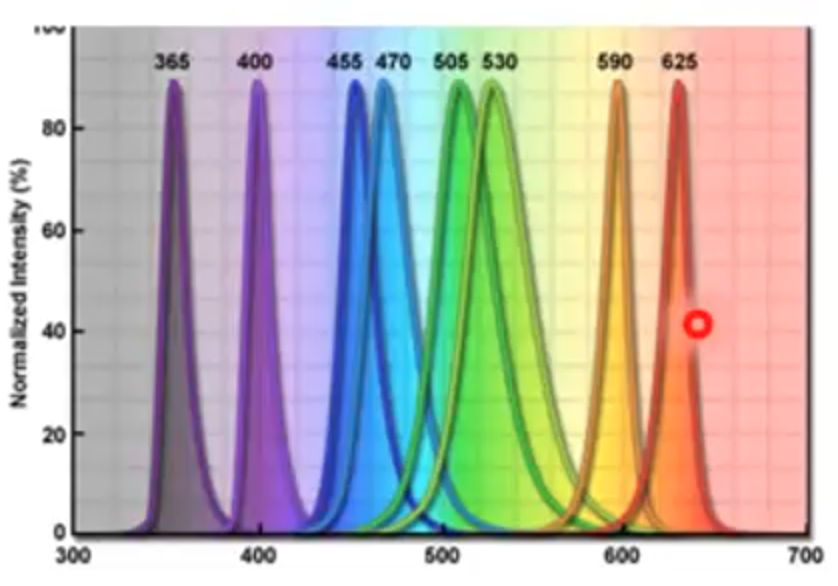

# Gráfico Radiométrico:
- 
- Um gráfico radiométrico, por outro lado, está relacionado às propriedades da luz em termos de radiação eletromagnética em diferentes faixas espectrais. Ele representa a distribuição espectral de energia emitida ou refletida por uma fonte de luz ou objeto.
- Esse tipo de gráfico mostra a quantidade de energia eletromagnética (frequência ou comprimento de onda) em diferentes partes do espectro eletromagnético, indicando a intensidade ou potência radiante em cada faixa de comprimento de onda.
- Os gráficos radiométricos são essenciais em áreas como astronomia, sensoriamento remoto, óptica, telecomunicações e física, ajudando a entender a distribuição espectral de radiação eletromagnética proveniente de diferentes fontes ou objetos.
- Em resumo, enquanto os gráficos colorimétricos representam cores percebidas pelo olho humano em termos de suas coordenadas de cor, os gráficos radiométricos descrevem a distribuição espectral de energia eletromagnética em diferentes partes do espectro, fornecendo informações sobre intensidade, potência e distribuição de energia radiante em várias faixas espectrais.