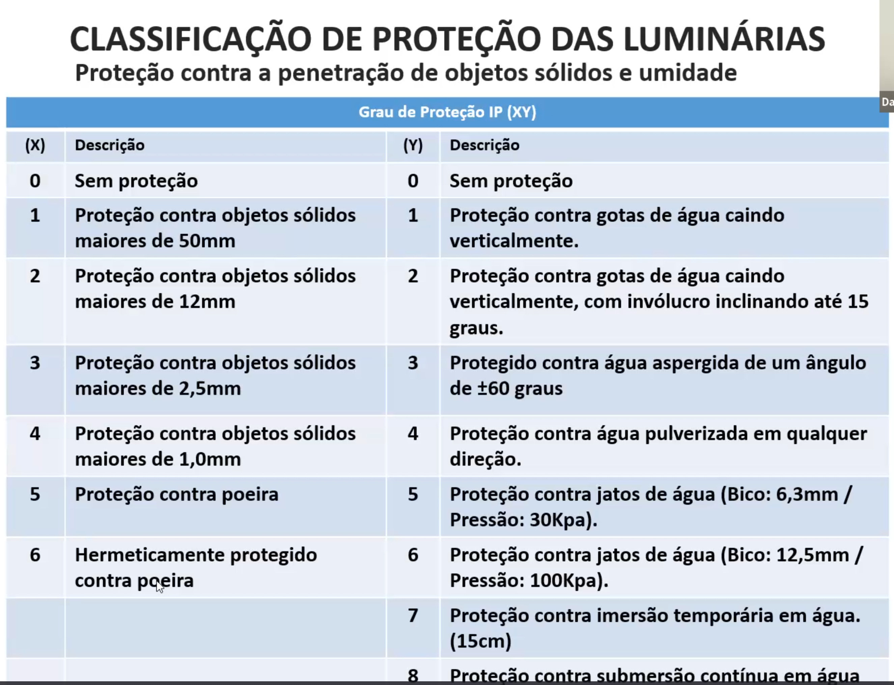

# Índice de Proteção (IP)
- Avalia quanto a luminária está vedada para sólido (poeira) e líquido (água).
- Dentro de área interna húmida
    - IP44 ou mais
- Em área Externa e em local com altura acima do solo:
    - IP65 e IP66
    - Poste de Iluminação pública
- Em área Externa e em local com altura na linha do solo ou sobre a linha do solo:
    - Se temporariamente submersa: IP67
- Submerso dentro da piscina:
    - IP68 (mas deve-se avaliar a pressão dentro da água)
