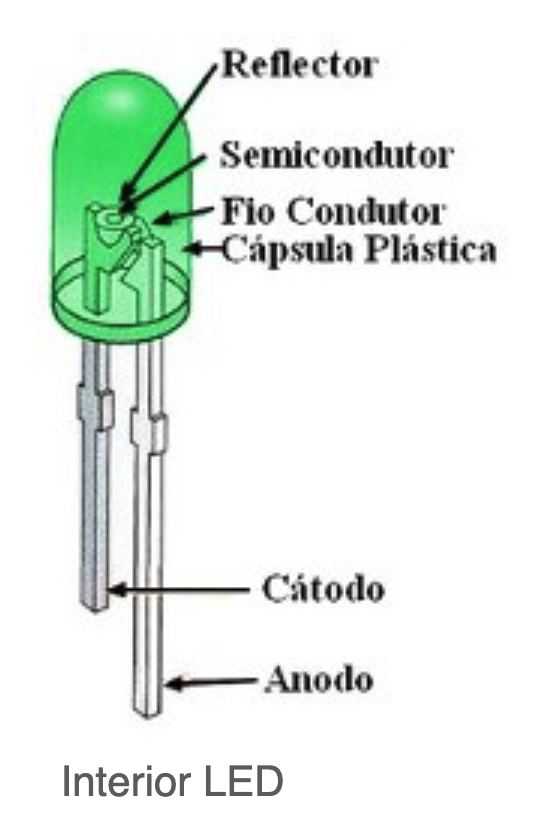

# LED
  
- Fluxo elétrico:
    - Ânodo (perna maior) fora da Capsula Plástica
    - Ânodo dentro da Cápsula Plástica
    - Fio Condutor
    - Material Semicondutor (forma de chapa plana) dentro de refletor
    - Fio Condutor
    - Cátodo (perna menor) dentro da Cápsula Plástica
    - Cátodo fora da Cápsula Plástica
- Cores produzidas por LED, sem fósforo e sem mistura:
    - Não há um comprimento de onda isolado na radiação. Há bandas reduzidas de comprimento de onda, com intervalo próximo a um valor central de referência.
        - Vermelho claro indo para Laranja -- 625 nm 
        - Laranja indo para Amarelo -- 600 nm
        - Verde entre 505 e 530 nm
        - Azul claro entre 455 e 470 nm
        - Azul Royal (indo para violeta) 400 nm (uso nas LEDs atuais)
        - Violeta indo para azul royal 365 nm
- Pode-se fazer arranjo dos LEDs, obtendo-se cores diferentes, inclusive o branco. Não é necessário usar fósforo em cima do lâmpada para gerar luz branca a partir do LED azul royal.
- Propriedades da LUZ:
    - A Intensidade da radiação pode ser somada!
    - Pode-se somar comprimentos de onda
    - Colorimetria
    - Pode-se criar qualquer espectro de luz!
- Mudança nos conceitos de:
    - Temperatura de cor
    - Indice de Reprodução da COR

- Luz de Estado Sólido
 

# Inovações
- 1970 -- LED
- 1991 -- Compactas fluorescentes
- 2001 -- OLED

- Propagação Ótica
- Luminescência Inorgánica
- Luminescência Orgânica
- LED, Driver e Dimmer
- Sistemas Digitais (DALI, DMX)
- IoF (Internet das Coisas)
- LiFi

- Dimerização de:
    - fluxo luminoso
    - temperatura da cor (não ocorre em lâmpada LED)

- Mudanca de lentes
    - Mudança na forma da Distruição da Intensidade Luminosa

- Tecnologia
    - Warm dimming (Dimming to warm)

- Importância da Temperatura de cor
    - Relação com espectro de LUZ

- Projeções de Eficácia segundo DOE
    - Departamento de Energia do Governo Estadunidense

- Controle dinâmico do espectro

- Emissão de luz com bandas reduzidas
    - Para controle do espectro da luz

- Propriedade Aditiva da Luz
    - Para controle do espectro da luz

- Sistemas Híbridos
    - Mescla LEDs coloridos com LEDs brancos

- Espectro de LUZ da lâmpada LED

- Tipos:
    - PC-LED Cool White
        - Led branco Frio
        - Maior eficiência Lumens por Watt
    - PC-LED Warm White
        - LED branco quente
        - Menor eficiência Lumens por Watt
    - Mas Departamento de Energia dos EUA informa que a eficácia da PC-LED Warm White está aumentando e está tendendo à eficácia de PC-LED Cool White.
    - Mas há uma nova tecnologia ainda mais promissora:
        - Produção de LUZ branca pela união de cores, e não pelo uso do filtro de fósforo.
        - Esta nova tecnologia tende a ser mais eficaz que o PC-LED Cool White e o PC-LED Warn White.
        - Esta tecnologia é nomeada como CM-LED (RYGB)
        - Esta tecnologia produz o Neutral White 

- Luz branca
    - Parte da Luz AZIL
     - O fósforo converte parte da luz azul para outras radiações com comprimento de onda diferentes.
    - No final de toda a produção, gera-se LUZ branca.
