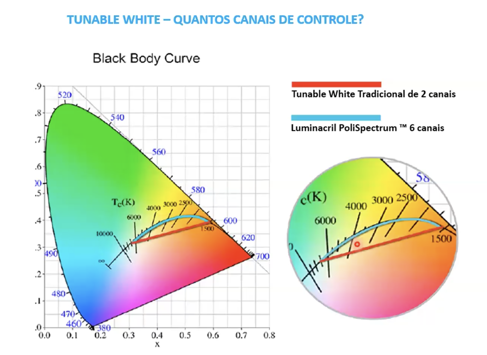

# Tunable White
- 
- Luminária com controle dinâmico da temperatura de cor
- Fluxo Luminoso do LED é proporcional à corrente elétrica do sistema.
- No arranjo de LED, pode-se diminiuir o fluxo luminoso de LEDS que possuem certa temperatura de cor e aumentar o fluxo de outras que possuem outra temperatura de cor.