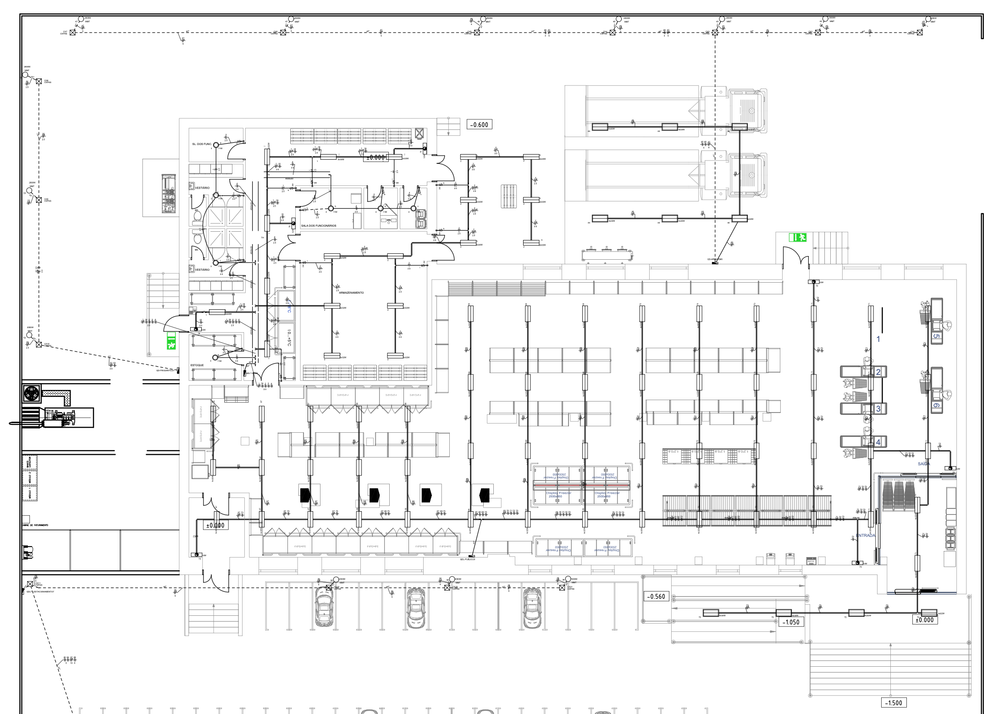

# Arquitetura da Aplicação
- Um projeto de iluminação nada mais é do que um documento que ajuda a identificar a melhor forma de usar a luz natural e artificial para deixar um ambiente mais funcional e agradável.  
- A Iluminação deve satisfazer os aspectos quantitativos e qualitativos exigidos pelo ambiente.
- Tudo começa com a imagem 3D do ambiente.
- A qualquer momento, deve-se poder alternar a visualização da Planta 3D para uma Planta Baixa. 

- Na Planta Baixa, pode-se optar por vez o detalhamento do tipo e da localização das luminárias.
- No detalhamento de cada luminária, deve-se indicar o:
- Potência energética
    - Joule/segundo J/s
    - watt W
    - kg·m²/s³
    - joule	J	kg·m²/s²	N·m
- Fluxo Luminoso
    - Parte da potência watt da luminária
    - Potência relacionada apenas às ondas de luz visível
    - Radiação luminosa por segundo
    - lúmen ( lm )
    - 1 lúmen é o fluxo luminoso dentro de um cone de 1 esferorradiano, emitido por um ponto luminoso com intensidade de 1 candela (em todas as direções)
        - 10^24	  **yotta**lúmen	Ylm
        - 10^21	  **zetta**lúmen	Zlm
        - 10^18	  **exa**lúmen	    Elm
        - 10^15	  **peta**lúmen	    Plm
        - 10^12	  **tera**lúmen	    Tlm
        - 10^9	  **giga**lúmen	    Glm
        - 10^6	  **mega**lúmen	    Mlm
        - 10^3	  **quilo**lúmen	klm
        - 10^2	  **hecto**lúmen	hlm
        - 10^1	  **deca**lúmen	    dalm
        - 10^0    **lúmen**         lm
        - 10^–1	  **deci**lúmen	    dlm
        - 10^–2	  **centi**lúmen	clm
        - 10^–3	  **mili**lúmen	    mlm
        - 10^–6	  **micro**lúmen	µlm
        - 10^–9	  **nano**lúmen	    nlm
        - 10^–12  **pico**lúmen	    plm
        - 10^–15  **femto**lúmen	flm
        - 10^–18  **atto**lúmen	    alm
        - 10^–21  **zepto**lúmen	zlm
        - 10^–24  **yocto**lúmen	ylm
- Eficência luminosa
    - Fluxo luminoso por Potência energética 
- Iluminância (ou luminosidade)
    - Medida de fluxo luminoso por metro quadrado 
    - lux
    - lm/m²
    - Calculado por aparelho chamado luxímetro. O luxímetro absorve e calcula a luminosidade de um local. Com ele é possível definir a luz ideal para eventos, residências, entre outros.
- Indicação da Necessidade de Iluminância Mantida (Em) para superficies
- Indicação de intervalos aceitáveis do Índice de Ofuscamento Unificado (UGR)
- Indicação de atendimento ao Índice Limite de Ofuscamento Unificado (UGR L)
- Quando necess´årio, indicação do ângulo de corte.
- Intensidade de radiação	watt por esferorradiano	W/sr	kg·m²/(s³·sr)	J/(s·sr)
- Intensidade Luminosa
- Luminância
- Análise da radiação da luz: 
    - Comprimento de ondas do deslocamento da radiação de luz
    - Frequência do descolamento da radiação da luz
        - hertz	Hz	1/s
    - Temperatura de cor da luz
    - Índice de Reprodução da Cor (IRC) da radiação de luz.
- Curva De *****
- Análise Ponto a Ponto
- Análise 
- Análise Qualitativa do ambiente luminoso:
    - A iluminação assegurou conforto visual, dando aos trabalhadores uma sensação de bem-estar?
    - A iluminação assegurou desempenho visual, ficando os trabalhadores capacitados a realizar suas tarefas visuais, rápida e precisamente, mesmo sob circunstâncias difíceis e durante longos períodos?
    - A Iluminação assegurou segurança visual, ao olhar ao redor e detectar perigos?
- Análise Quantitativa do ambiente luminoso:
    - Distribuição da luminância
    - Iluminância (valores de projeto estabelecidos na Seção 5 da norma)
    - Ofuscamento (valores de projeto estabelecidos na Seção 5 da norma)
    - Direcionalidade da luz
    - Aspectos da cor da luz e suerfícies (valores de projeto da reprodução da cor estabelecidos na Seção 5 da norma)
    - Cintilação
    - Luz natural
    - Manutenção

- O Aplicativo deve mostrar a Planta Baixa em formato padrão da arquitetura
